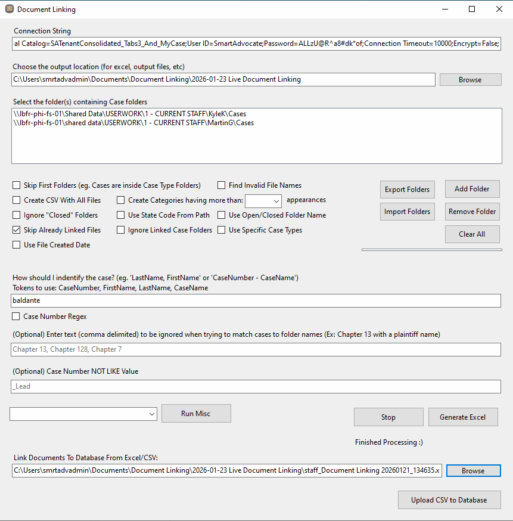

# Baldante Highrise

```sql
drop table Baldante_Highrise..phone
drop table Baldante_Highrise..address
drop table Baldante_Highrise..email_address
drop table Baldante_Highrise..emails
drop table Baldante_Highrise..email
drop table Baldante_Highrise..notes
drop table Baldante_Highrise..tasks
drop table Baldante_Highrise..contacts
drop table Baldante_Highrise..company
```

`Data Source=dylans\mssqlserver2022; Initial Catalog=Baldante_Consolidated; User Id =sa; Password=Int3gra!1; Connection Timeout=10000`

## Installation
1. Create python virtual enviroment
```bash
py -m venv .venv
```
2. Activate the virtual environment and install dependencies from `requirements.txt`
```bash
.\.venv\scripts\activate
pip install -r requirements.txt
```

## Highrise Data Structure
Highrise data: `D:\Baldante\data\2025-08-21\contacts`

**Contact** files contain actual names: `Mitchell Morris.txt`
- Name
- Tags
- Background
- Address
- Email Address
- Phone Numbers
- Notes
- Emails
- Tasks

**Company** files are numeric: `45985.578.txt`
- Name
- Tags
- Background
- Address
- Email Address
- Phone Numbers
- Notes
- Emails
- Tasks


**Contact - Company Relationship**

`[company].[id] <--> [contact].[company].[id]`


**Email - Contact - Company Relationship**


## Merging data into Tabs3 cases

`[company].[name]` = `[contacts].[company_name]` = Tabs3 case number

```sql
-- emails from [contacts] for Tabs3 cases
select
	e.id,
	e.email_key,
	e.contact_id,
	e.company_id,
	e.subject,
	e.body,
	e.written_date,
	e.author,
	cas.casnCaseID,
	cas.source_id,
	cas.source_db,
	cas.source_ref
from Baldante_Highrise..emails e
join Baldante_Highrise..contacts c
	on e.contact_id = c.id
join sma_TRN_Cases cas
	on cas.cassCaseNumber = c.company_name
		and cas.source_db = 'Tabs3'

union all

-- Emails from [company] for Tabs3 cases
select
	e.id,
	e.email_key,
	e.contact_id,
	e.company_id,
	e.subject,
	e.body,
	e.written_date,
	e.author,
	cas.casnCaseID,
	cas.source_id,
	cas.source_db,
	cas.source_ref
from Baldante_Highrise..emails e
join Baldante_Highrise..company com
	on e.company_id = com.id
join sma_TRN_Cases cas
	on cas.cassCaseNumber = com.name
		and cas.source_db = 'Tabs3'
```

## Conversion Procedure

### Parse Highrise data
`D:\Baldante\highrise\1_discovery\main.py`

```py
py -m highrise.parse_data.main <server> <database> <input_folder>
py -m highrise.parse_data.main -s dylans\mssqlserver2022 -d baldante_highrise -i D:\Baldante\data\2025-08-21\contacts
```

### Run migration scripts
`D:\Baldante\highrise\conversion`

```bash
sami run -f D:\Baldante\highrise\conversion -s dylans\mssqlserver2022 -d baldante_consolidated
```
**General strategy**
1. create functions and SPs
2. create `[implementation_users]`
3. insert Highrise contacts
4. insert contact information into Highrise contacts
5. insert contact information into Tabs3 contacts
6. recreate `[AllContactInfo]`
7. recreate `[IndvOrgContacts__Indexed]`
8. insert Cases from Highrise (case groups, case types, roles)
9. insert Notes, Tasks, Emails into cases (Highrise and Tabs3)


## Table Reference

```sql
select * from Baldante..contacts
select * from Baldante..address
select * from Baldante..phone
select * from Baldante..email
select * from Baldante..company
select * from Baldante..notes
select * from Baldante..tasks
```


# Doc Linking
recording: `Y:\Jimmys Stuff\video1566446156.mp4`

workspace:
- `C:\Users\smrtadvadmin\Documents\Document Linking\2026-01-23 Live Document Linking`
- `C:\Users\smrtadvadmin\Documents\Document Linking\2026-01-23 Live Document Linking\Baldante_Linking_Info.txt`
- `C:\Users\smrtadvadmin\Documents\Document Linking\2026-01-23 Live Document Linking\Import Folders`

- [ ] desktop > `net8.0-windows` > DocumentLinking.exe
- [ ] Enter connection string from `C:\Users\smrtadvadmin\Documents\Document Linking\2026-01-23 Live Document Linking\Baldante_Linking_Info.txt`
- [ ] Enter output dir: `C:\Users\smrtadvadmin\Documents\Document Linking\2026-01-23 Live Document Linking`

## Generate document mapping spreadsheets
- [ ] Import Folders from `C:\Users\smrtadvadmin\Documents\Document Linking\2026-01-23 Live Document Linking\Import Folders`
	- [ ] `Clergy_CaseFoldersList_20260119.csv`
	- [ ] `Drug_CaseFolders.csv`
	- [ ] `NFL_CaseFolders.csv`
	- [ ] `Staff_CaseFolders.csv`
5. Enter token: `baldante`
6. Generate Excel. result goes to output dir
7. rename result file, i.e. `staff_`, `NFL_`
8. verify there are some case matches

## Upload document mapping spreadsheets (link documents to cases)
after all 4 created: 
- [ ] Select each prefixed file 
upload csv to database
email output sheets to sue


## Linking Exceptions
client will fills out exceptions and possible matches
copy their work into a blank doc linking sheet
upload that sheet





- C:\Users\smrtadvadmin\Documents\Document Linking\2026-01-23 Live Document Linking